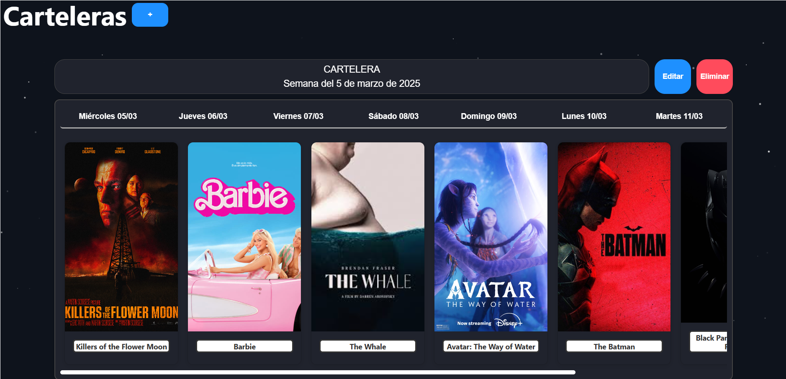

# Cine10

Cine10 es el proyecto integrador grupal desarrollado durante el último cuatrimestre del primer año de la Tecnicatura Universitaria en Programación. En este trabajo se consolidaron los conocimientos adquiridos en la asignatura **Programación II**, abarcando desde el desarrollo web (HTML, CSS, JavaScript) hasta la integración con el backend (APIs RESTful, Swagger, Postman). Además, se aplicaron conceptos avanzados de programación orientada a objetos y se utilizaron patrones de diseño, como el Repository.

---

## Descripción del Proyecto

El proyecto se basa en la gestión de un cine, orientado a facilitar la administración integral del mismo. Se pueden gestionar las carteleras, las películas y sus funciones. Se adoptó un modelo maestro-detalle, donde la **Cartelera** actúa como entidad principal y las **Películas** conforman sus detalles. Las funciones se incluyeron como un complemento adicional para enriquecer la experiencia y lograr un producto final de alto nivel.

---

## Objetivos

- **Integración de Conocimientos:** Aplicar de manera práctica las habilidades adquiridas durante la asignatura.
- **Solución de Problemas:** Fortalecer las destrezas para resolver situaciones complejas mediante la programación orientada a objetos en C# y el desarrollo de aplicaciones cliente-servidor con Web API.
- **Modelado de Datos:** Diseñar una abstracción de datos utilizando patrones de diseño y buenas prácticas de programación.
- **Desarrollo de Interfaces:** Crear una interfaz web utilizando HTML, CSS y JavaScript que consuma los servicios expuestos a través de una Web API.

---

## Funcionalidades

### Backend

- **Web API:** Consumo y manipulación de datos almacenados en una base de datos SQL Server.
- **ABMC:** Sistema completo para dar de alta, modificar, borrar y consultar (ABMC) las tablas de **Cartelera**, **Películas** y **Funciones**.
- **Autenticación y Autorización:** Implementación de JWT (JSON Web Token) para el manejo seguro de la sesión de usuario.
- **Filtros Personalizados:** Desarrollo de filtros que permiten, mediante parámetros en los constructores, optimizar la consulta de funciones, películas o mostrar información resumida en la página de inicio.

### Frontend

- **Landing Page:** Página de bienvenida que redirige a dos secciones principales:
    - **Nosotros:** Presentación del equipo de trabajo, acompañada de un video explicativo del proyecto alojado en YouTube.
    - **Login:** Página de acceso para ingresar a la aplicación.
- **Página de Login:** Sistema de autenticación que utiliza JWT para validar el acceso del usuario.
- **Página Principal:** Dividida en cuatro secciones:
    - **Inicio:** Información general, como la cartelera vigente de la semana y datos del usuario recién registrado.
    - **Funciones, Películas y Carteleras:** Módulos que permiten realizar ABMC, interactuando directamente con la base de datos a través de los endpoints de la API.

---

## Tecnologías Utilizadas

- **Backend:** C#, Web API, SQL Server, JWT, Swagger, Postman.
- **Frontend:** HTML, CSS ,Bootstrap ,JavaScript .

---

Este proyecto representa la integración efectiva de conocimientos teóricos y prácticos, resultando en una aplicación robusta y escalable para la administración integral de un cine.

## Imagenes sobre las principales funcionalidades del sistema :

## Cartelera

## Peliculas

## Funciones

